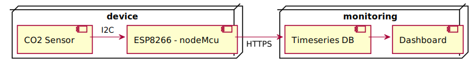

# is-env-monitor
Monitoring the office environment the right way.

## Device
### CO2 Sensor
there are in general 2 types of sensors:
#### Type 1

* SCD30 
  * https://nl.aliexpress.com/item/1005001863337536.html?spm=a2g0o.detail.1000060.1.e0443c9f9d84z6&gps-id=pcDetailBottomMoreThisSeller&scm=1007.13339.169870.0&scm_id=1007.13339.169870.0&scm-url=1007.13339.169870.0&pvid=ae2756a4-46f9-4d38-9c79-55d89ec5292a&_t=gps-id:pcDetailBottomMoreThisSeller,scm-url:1007.13339.169870.0,pvid:ae2756a4-46f9-4d38-9c79-55d89ec5292a,tpp_buckets:668%232846%238111%231996&&pdp_ext_f=%7B%22sku_id%22:%2212000025002923696%22,%22sceneId%22:%223339%22%7D

* MH-Z14A
  * https://opencircuit.be/product/MH-Z14A-Koolstofdioxide-sensor-5000ppm

#### Type 2
* CCS811 
  * https://opencircuit.be/product/Luchtkwaliteit.-CO2.-temperatuur-luchtvochtigh
  * https://nl.aliexpress.com/item/4000012627480.html?spm=a2g0o.productlist.0.0.5eb0b8b9VkEFWu&algo_pvid=b201f8d8-243d-459a-afd1-3be09e285447&aem_p4p_detail=202111250738248354312415084910009386529&algo_exp_id=b201f8d8-243d-459a-afd1-3be09e285447-9&pdp_ext_f=%7B%22sku_id%22%3A%2210000000031905184%22%7D

### ESP8266
https://nl.aliexpress.com/item/4000160133215.html?spm=a2g0o.productlist.0.0.7c267b5eKPaJMo&algo_pvid=ac495fbb-53c5-4d0c-bb6c-1a62ec1a9013&algo_exp_id=ac495fbb-53c5-4d0c-bb6c-1a62ec1a9013-0&pdp_ext_f=%7B%22sku_id%22%3A%2210000000516093098%22%7D

## Monitoring
For the monitoring solution, multiple options are available:
* Grafana
* Influxdb + custom dashboard
* Prometheus
* Azure application insights
* ...
### Timeseries Database

### Dashboard
